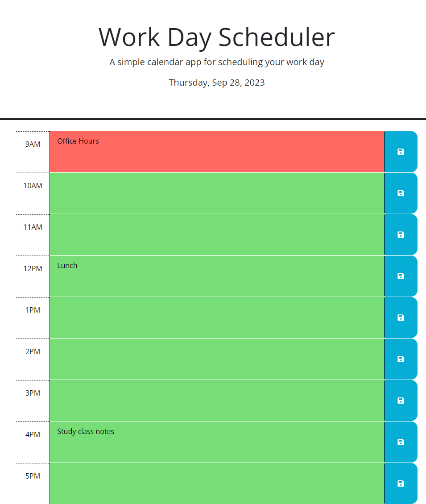

# Work-Day-Scheduler-Challenge-5

## Description

With the goal of having a simple scheduler to manage my workday, I created a Work Day Scheduler. On loading the page, the current day will display. There are hour long time blocks from 9:00am to 5:00pm. Each block will be color-coded. Grey is a past time, red is the current time and green is a furture time. The color coding will update with the acutal current time throughout the day. Tasks can be entered in each time block and saved. Upon page refresh, the tasks will persist.

## Installation

N/A

## Usage

https://github.com/ericolson1977/Work-Day-Scheduler-Challenge-5

https://ericolson1977.github.io/Work-Day-Scheduler-Challenge-5/

## Credits

N/A

## License

Please refer to the LICENSE in the repo.

---